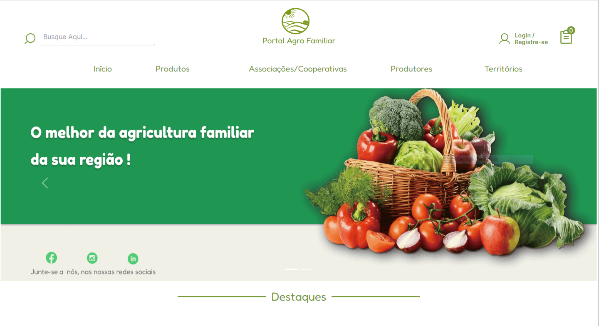
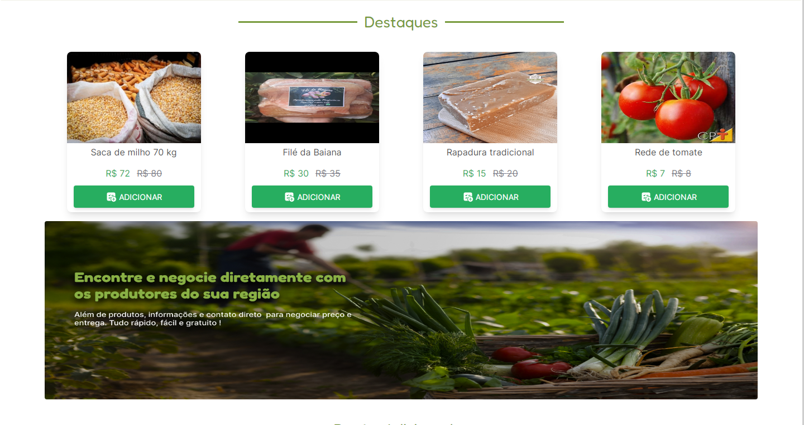

## LICENSE!

## 💻 Sobre o projeto

A plataforma AgroFamiliar é um concentrador e facilitador das relações entre o consumidor e produtores familiares da regionais. 

[Confira o projeto](https://agrofamiliar.vercel.app/) 


## TECNOLOGIAS USADAS

* JavaScript/TypeScript
* ReactJS
* TailwindCSS
* Firebase
      


## 🎨 Layout

</br>
O layout da aplicação está disponível no Figma:

<a href="https://www.figma.com/file/k3a79RNr0AYBGEVI24Yn1Y/Catalogo-Digital?node-id=49%3A2">
  
</a>


### Web

<p align="center" style="display: flex; align-items: flex-start; justify-content: space-between;">


</p>

### Mobile

<p align="center"  style="display: flex; align-items: flex-start; justify-content: space-between;">
 

</p>

### Pré-requisitos

Antes de começar, você vai precisar ter instalado em sua máquina as seguintes ferramentas:
[Git](https://git-scm.com), e ReactJS
Além disto, é bom ter um editor para trabalhar com o código como [VSCode](https://code.visualstudio.com/)

### 🎲 Rodando o Projeto

```bash
# Clone este repositório
$ git clone <[https://github.com/ManoelPatrocinio/ecatalogo](https://github.com/ManoelPatrocinio/Agro_Familiar)>

# Acesse a pasta do projeto no terminal/cmd
$ cd Agro_Familiar

# Instale as dependências iniciais
$ npm install
$ npm install --global yarn
$ yarn init -Y

# Execute a aplicação
$ yarn start

# O servidor inciará na porta:3000 - acesse <http://localhost:3000>


```

### Autor

Feito por  Manoel Patrocinio 👋🏽 Entre em contato!

[](https://www.instagram.com/patrocinioiii/) [](https://linkedin.com/in/manoel-patrocinio-1b342b203)
[](mailto:manoelpatrocinio99@gmail.com)
